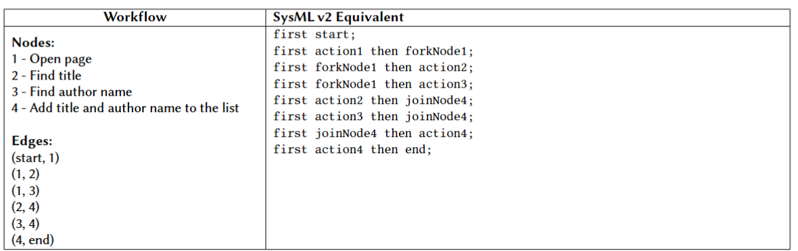

# Transforming WorFBench

**WorFBench** is a benchmark designed to evaluate the ability of Large Language Models (LLMs) to generate graphical workflows from natural language instructions, represented as a list of nodes and a list of edges. The benchmark covers a diverse range of workflow generation tasks, including problem solving, function calling, embodied planning, and open-grounded planning. It comprises 18k training samples, 2146 test samples, and 723 held-out tasks intended to evaluate generalization. In addition, each workflow instance is paired with its corresponding user prompt, which serves as a natural language description of the target workflow.

## Transformation to SysML

To adapt this dataset to our modeling setting, we implemented a deterministic transformation pipeline that converts WorFBench workflow graphs into SysML code. More precisely, the nodes of the original graph are interpreted as actions, while the edges are mapped to succession flows capturing the execution order between actions. This transformation converts each workflow graph into SysML code while keeping the original order and dependencies between actions.

## Validation

To assess the quality of the transformation, we applied two complementary validation steps.

**Manual Inspection** : First, we manually inspected a subset of transformed instances by visualizing the generated SysML models, in order to verify that the resulting code remained semantically consistent with the original workflows.

**Automated Validation** : Second, to validate the correctness of the generated models at scale, we used the pilot implementation parser and PlantUML exporter to read all generated files. Using the PlantUML exporter has the nice property of validating the full file and allows us to have a second check that the workflow is correct.

## Generated Dataset Size

Using this transformation process, we generated a dataset of approximately 17.8k SysML workflow models derived from WorFBench.

## Example

Table illustrating a simple example of this transformation logic is provided in the paper.

